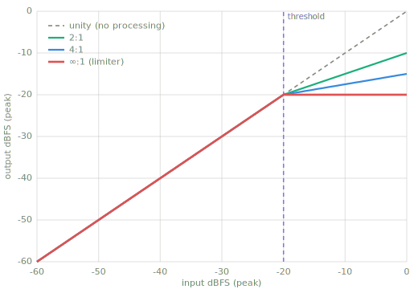
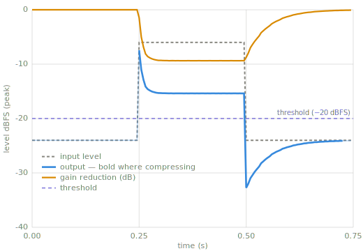

# Compression

> **Dynamic range compression** automatically turns down the *loud* parts of a signal so
> the gap between loud and quiet shrinks — making a track sit more evenly and feel louder.

*Chapter 5 — time-domain level effects. See also [Tremolo](tremolo.md),
[Limiting](limiter.md), [Expanding](expander.md), and the slower, target-seeking
[AGC](agc.md).*

---

## Intuition — what & why

Imagine a sound engineer with one hand on a volume fader, pulling it down the instant a
singer belts too loud and pushing it back up when they go quiet. A compressor is that hand,
automated. You set *how loud is "too loud"* (threshold) and *how hard to pull it down*
(ratio), and it rides the level for you.

**Why you'd use it:** even out an erratic performance, tame peaks so you can raise overall
loudness, glue a mix together, add punch or sustain.

## Key parameters

| Parameter | What it controls |
|---|---|
| **Threshold** | The level above which compression kicks in (dB). |
| **Ratio** | How much to reduce signal over threshold. 4:1 = 4 dB in → 1 dB out. |
| **Attack** | How fast it clamps down once threshold is crossed (ms). |
| **Release** | How fast it lets go once the signal drops back (ms). |
| **Knee** | How abruptly the ratio engages around the threshold (hard vs. soft). |
| **Makeup gain** | Fixed boost after compression to restore overall loudness (dB). |

## How it works

1. **Detect the level** of the incoming signal (peak or RMS envelope).
2. **Compare to threshold.** Below it → leave alone. Above it → compute gain reduction
   from the ratio.
3. **Smooth the gain change** over time using the attack/release time constants (so it
   doesn't distort).
4. **Apply** the (smoothed) gain to the signal, then add makeup gain.

Two figures, both generated by running this book's own compressor
(`code/make_figures.py`):



*The static transfer function: what the ratio does to steady-state level. Every curve is
unity below the threshold. The ∞:1 curve is a limiter.*



*The same compressor in time: a quiet–loud–quiet tone at 4:1, −20 dBFS threshold, 5 ms
attack, 50 ms release. The gain line dives at the onset (attack) and climbs back after the
loud section ends (release). The output is bold only where the compressor is actually
working; elsewhere it equals the input.*

## Pseudocode

```text
for each sample x:
    level   = envelope(|x|)                  # peak/RMS detector
    if level > threshold:
        excess      = level - threshold      # in dB
        target_gain = -excess * (1 - 1/ratio)
    else:
        target_gain = 0
    gain = smooth(gain, target_gain, attack, release)   # one-pole follow
    y = x * dB_to_linear(gain) * dB_to_linear(makeup)
```

## Reference implementation (Python)

```python
import math

def compress(x, sr, threshold_db=-20.0, ratio=4.0,
             attack_ms=5.0, release_ms=50.0, makeup_db=0.0):
    """Simple feed-forward peak compressor — pure standard library, no dependencies.

    x:  list of mono samples (floats in [-1, 1])
    sr: sample rate in Hz
    Returns a new list of processed samples.
    """
    atk = math.exp(-1.0 / (sr * attack_ms  / 1000.0))
    rel = math.exp(-1.0 / (sr * release_ms / 1000.0))
    eps = 1e-9

    y = []
    env_db = -120.0      # smoothed gain-reduction state, in dB
    for sample in x:
        level_db = 20.0 * math.log10(abs(sample) + eps)   # dBFS (peak), per sample
        over = level_db - threshold_db
        target = -over * (1.0 - 1.0 / ratio) if over > 0 else 0.0
        # attack when clamping harder, release when easing off
        coeff = atk if target < env_db else rel
        env_db = coeff * env_db + (1.0 - coeff) * target
        gain = 10.0 ** ((env_db + makeup_db) / 20.0)
        y.append(sample * gain)
    return y
```

!!! warning "Pitfalls"
    - **Pumping/breathing:** release too fast makes the level audibly surge between hits.
    - **dB vs. linear:** gain math lives in dB; sample math lives in linear. Convert carefully.
    - **Lookahead:** a pure feed-forward detector reacts *after* a transient — real limiters
      add lookahead to catch it.

## Related effects

- **[Automatic Gain Control](agc.md)** — its slower, target-seeking cousin (the pair).
- **[Limiting](limiter.md)** — compression with an ∞:1 ratio and fast attack.
- **[Expanding](expander.md) / Gate** — the inverse: turns *down* the quiet parts.

## Learn more

- Zölzer & Holters, **Digital Audio Effects**.
