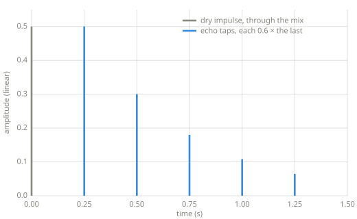

# Delay lines

> Every effect in this chapter is built from one device. A delay line is memory that
> returns a signal after a wait, $y[n] = x[n-D]$ for a delay of $D$ samples. Heard
> directly it is an echo. Swept by an LFO it becomes vibrato and chorus, and a network of
> delay lines becomes reverb.

*Chapter 7 — delay and modulation.*

---

## The ring buffer

A delay line needs the recent past: the last $N$ samples, readable by age. A plain
queue would serve a fixed delay, one sample in and the oldest sample out. The effects in
this chapter ask for more. Vibrato reads at an offset that changes every sample, and the
reverberator's allpass stages read two lines at once, so the delay line has to offer
random access by age rather than only the oldest value. The structure with exactly those
properties is the ring buffer, one write position advancing through fixed memory.

A delay line also remembers more than anything earlier in the book. The envelope
follower of [Chapter 5](envelopes.md) carries one number between samples. A delay line
carries a stretch of signal, and the stretch has to cover the longest delay the effect
will ask for.

```python
--8<-- "code/delays.py:ringbuffer"
```

## Echo

An echo is a delay line heard directly, with the output fed back in so each repeat
returns quieter:

$$
y[n] = x[n] + g \cdot y[n-D]
$$

where $g$ is the feedback factor. Each round trip through the line multiplies the repeat
by $g$, so the repeats decay geometrically.

```python
--8<-- "code/delays.py:echo"
```



*The echo's impulse response, generated with the `echo` above. Feedback is the whole
picture: every tap is the previous tap times the feedback factor, which is a geometric
decay.*

## Key parameters

| Parameter | What it controls |
|---|---|
| Delay | The time between repeats (ms). |
| Feedback | How much of the output recirculates, and so how many repeats are audible. |
| Mix | The balance between the dry signal and the delayed one. |

!!! warning "Pitfalls"
    - Feedback of 1.0 or more diverges. Each pass then returns as loud or louder, and the
      output grows without bound. Keep $g$ below 1.
    - Short delays stop sounding like repeats. Below roughly 30 ms the ear fuses the
      copies into one sound, and the delay line colors the timbre instead. That coloring
      is the comb filtering that [Reverb](reverb.md) builds from, and the fused range is
      where [Chorus](chorus.md) lives.

## Where this leads

[Vibrato](vibrato.md) points an LFO at the delay time. [Chorus](chorus.md) mixes that
wobbling copy with the original. [Reverb](reverb.md) runs many delay lines at once.

## Learn more

- Udo Zölzer (ed.), *DAFX: Digital Audio Effects*, 2nd ed., Wiley — delay-based effects.
- Julius O. Smith III, *Physical Audio Signal Processing*,
  [ccrma.stanford.edu/~jos/pasp](https://ccrma.stanford.edu/~jos/pasp/) — delay lines and
  comb filters, formally.
