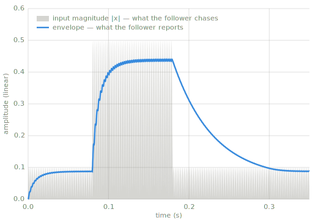

# Envelopes

> An envelope is a curve that describes how a signal's level changes over time: the
> outline of the signal's body, ignoring the wiggles inside it.

*Chapter 5 — envelopes & tremolo. The code below is included at build time from
`code/oscillators.py`, which is tested and drawn from by the figures.*

---

Envelopes come in two kinds. Generated envelopes are prescribed: a synthesizer shapes each
note's loudness with attack, decay, sustain, and release segments (ADSR). That belongs to
synthesis, and this book leaves it there; the term is noted because the word "envelope"
covers both kinds. Measured envelopes are extracted from a signal that already exists, and
they are what the effect chapters need. [Tremolo](tremolo.md), this chapter's other page,
uses a generated control curve; the follower below produces the measured one that
[Chapter 6](compression.md) is built on.

## Following level over time: attack & release

Effects rarely react instantly; an instantaneous gain change distorts. The response is
smoothed with two time constants:

- Attack: how quickly the effect responds when the level rises.
- Release: how quickly it relaxes when the level falls.

The standard tool is a one-pole smoother, also called an exponential follower. A
coefficient derived from a time in milliseconds controls how sluggish it is:

```python
--8<-- "code/oscillators.py:follow"
```

The follow pattern (measure, then smooth toward the measurement) is the backbone of every
effect in [Chapter 6](compression.md). The effects differ mainly in what they do with the
smoothed level.



*The `follow` function above, run on a quiet–loud–quiet tone (`code/make_figures.py`). The
gray region is the input's magnitude, the value the follower chases; the blue line is the
follower's output. It rises quickly when the burst starts (attack) and decays slowly after
it ends (release). The amplitude axis is linear, like the transfer curves of
[Chapter 3](single-sample.md); level-over-time figures elsewhere are in dB.*

The envelope does not reach the crests, and the gap is not an error. Each crest of the
magnitude lasts an instant, while the follower's 5 ms attack spans several 2 ms humps of
the rectified tone: the follower charges partway up during each hump, decays slightly
between humps, and settles where the two balance. A one-pole follower reports a smoothed
magnitude, not the true peak. Lengthening the attack widens that gap but shrinks the
residual ripple; shortening it does the reverse. Every effect in
[Chapter 6](compression.md) inherits this trade.

!!! warning "Pitfall"
    Sample rate is part of every time constant. The same `attack_ms` gives a different
    coefficient at 44.1 kHz than at 48 kHz; always pass `sr` through.

## Where this leads

[Tremolo](tremolo.md) drives a volume knob from a generated curve. The companding effects
of [Chapter 6](compression.md) drive the same knob from this page's follower.
