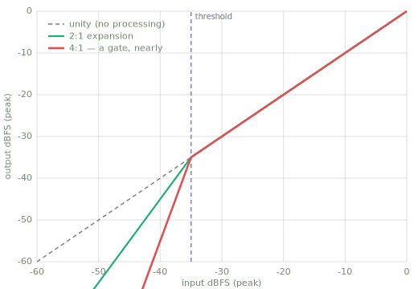
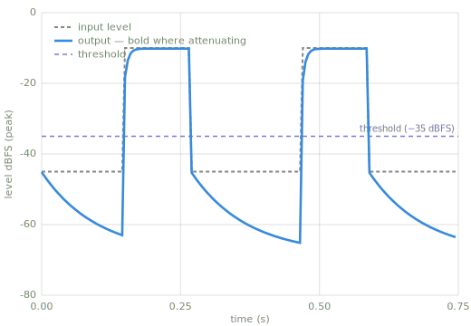

# Expanding

> An **expander** is the mirror image of a compressor: instead of taming what's *loud*, it turns
> *down* what's **quiet**, pushing the soft parts further down and so *increasing* the dynamic
> range. Taken to the extreme it becomes a **noise gate**.

*Chapter 2 — Companding. The inverse of [Compression](compression.md); a gate is its extreme
setting.*

---

## Intuition — what & why

A compressor shrinks the gap between loud and quiet by pulling the loud parts down. An expander
widens that gap by pushing the *quiet* parts down. Below a chosen threshold, the quieter the
signal, the more it gets attenuated.

**Why you'd use it:** push down hiss, hum, or microphone bleed in the gaps between notes or
words; restore punch to an over-compressed signal; or — with a steep enough ratio — **gate**
the signal so it's effectively silent until real sound arrives (think of muting a drum mic
except when the drum is actually hit).

The word **companding** = **com**pressing + ex**pand**ing. Compression and expansion are the
two halves of this chapter's machinery, working in opposite directions around a threshold.

## Key parameters

| Parameter | What it controls |
|---|---|
| **Threshold** | The level (dBFS) *below* which attenuation begins. |
| **Ratio** | How hard it pulls down below threshold. 2:1 doubles the dB drop; very high ≈ a gate. |
| **Range** | The maximum attenuation — how far down the quiet parts may be pushed. |
| **Attack** | How fast it "opens" (eases off) when the signal rises back above threshold. |
| **Release** | How fast it "closes" (attenuates) when the signal falls below. |

## How it works

Same detect → map → smooth → apply pipeline, but the transfer function bends the *opposite*
way from a compressor:

1. **Detect** the level (peak or RMS).
2. **Compare to threshold.** *Above* it → leave alone. *Below* it → compute attenuation that
   grows the further below threshold the signal sits (scaled by the ratio), limited by the range.
3. **Smooth** with attack (opening) and release (closing) time constants.
4. **Apply** the gain.

A **gate** is just an expander with a high ratio and a deep range — below threshold it slams the
signal toward silence instead of gently lowering it.



*The expander's transfer curve bends down below the threshold — compare the Compression
page's figure, where the bend is above. The steep red curve is most of the way to a gate.*



*The expander in time (`code/make_figures.py`, using this page's implementation): bold where
it is attenuating — which, note, is the quiet stretches. It acts on exactly the sections a
compressor ignores.*

## Pseudocode

```text
for each sample x:
    level   = dBFS(|x|)
    under   = threshold - level                  # how far BELOW threshold
    target  = -under * (ratio - 1)  if under > 0 else 0
    target  = max(target, range)                 # don't exceed the range
    gain    = smooth(gain, target, attack, release)
    y = x * dB_to_linear(gain)
```

## Reference implementation (Python)

```python
import math

def expand(x, sr, threshold_db=-40.0, ratio=2.0, range_db=-40.0,
           attack_ms=5.0, release_ms=100.0):
    """Feed-forward downward expander — pure standard library, no dependencies.

    Below threshold_db it attenuates, increasing dynamic range. A high ratio
    with a deep range_db turns it into a noise gate.

    x:  list of mono samples in [-1, 1]
    sr: sample rate (Hz)
    Returns a new list of samples.
    """
    atk = math.exp(-1.0 / (sr * attack_ms  / 1000.0))
    rel = math.exp(-1.0 / (sr * release_ms / 1000.0))
    eps = 1e-9

    y = []
    env_db = 0.0     # smoothed gain, in dB (<= 0)
    for sample in x:
        level_db = 20.0 * math.log10(abs(sample) + eps)
        under = threshold_db - level_db                 # positive when below threshold
        target = -under * (ratio - 1.0) if under > 0.0 else 0.0
        target = max(target, range_db)                  # floor the attenuation
        # open (toward less attenuation) fast; close (toward more) on release
        coeff = atk if target > env_db else rel
        env_db = coeff * env_db + (1.0 - coeff) * target
        y.append(sample * 10.0 ** (env_db / 20.0))
    return y
```

!!! warning "Pitfalls"
    - **Chattering.** When the level hovers right at the threshold, the expander/gate flickers
      open and shut. Real gates add **hysteresis** (separate open/close thresholds) and a
      **hold** time to stop the flutter.
    - **Chopped tails.** Too fast a release swallows reverb tails, breaths, and note decays —
      the natural quiet bits you often want to keep.
    - **Ratio direction.** Expansion attenuates *below* threshold; compression attenuates
      *above* it. Mixing up which side you're acting on is the classic beginner error.

## Related effects

- **[Compression](compression.md)** — the inverse: tames loud parts above a threshold.
- **Noise gate** — an expander with a high ratio and deep range (silence below threshold).
- **[Conventions](conventions.md)** — the level detector and one-pole follower this is built from.

## Learn more

- Udo Zölzer (ed.), **DAFX: Digital Audio Effects**, 2nd ed., Wiley — its `compexp.m` does
  compression *and* expansion in one expression.
- Reference implementations in `thirdparty/compare/`: **dafx** `compexp.m` (combined
  compressor/expander), **sox** `compand` (expansion via transfer-curve breakpoints).
