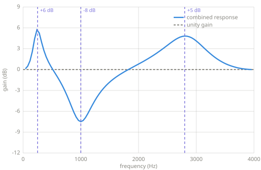
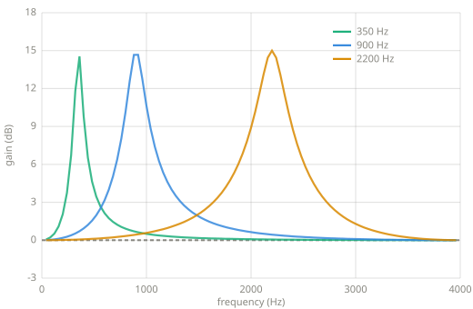
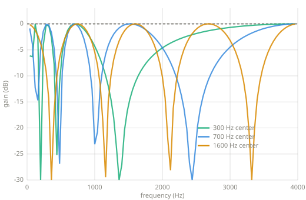

# Filter effects

> Equalization combines fixed filters. Wah and phasing move filters while audio passes
> through them. These effects turn the machinery of Chapter 9 into controls for tone and
> motion.

*Chapter 10 — filter effects, between [Filters](filters.md) and the
[DFT, FFT, and STFT](transforms.md).*

---

## Equalization

An equalizer sets gain by frequency region. A parametric equalizer describes each region
with a center frequency, gain, and Q. Positive gain boosts the region. Negative gain cuts
it. Q controls the width around the center frequency.

One peaking biquad supplies one band. Several bands run in series, so the output of one
becomes the input of the next. Gain is multiplied in linear amplitude and added in dB.
For example, a 3 dB boost from one band and a 2 dB boost from another produce 5 dB where
their responses overlap.



*Three peaking biquads in series. Their settings are +6 dB at 250 Hz, -8 dB at
1000 Hz, and +5 dB at 2800 Hz. The plotted curve is the measured response of the complete
equalizer.*

The code accepts a list of `(frequency, gain_db, q)` settings. It obtains the coefficients
for each peaking filter from the Audio EQ Cookbook formula and runs the sections in order.

```text
EQUALIZE(x, sr, bands)
    y ← x
    for each (frequency, gain, Q) in bands
        coefficients ← PEAKING-COEFFICIENTS(sr, frequency, gain, Q)
        y ← BIQUAD(y, coefficients)
    return y
```

## Wah

A wah moves a narrow boost through the spectrum. A low position emphasizes lower
frequencies, and a high position emphasizes higher frequencies. The moving peak changes
the relative strengths of a sound's harmonics. A pedal can control the center frequency
directly. An LFO or an envelope follower can move it automatically.

The reference implementation uses an LFO. The center frequency moves on a logarithmic
scale because equal ratios correspond to equal musical intervals. The midpoint between
350 and 2200 Hz is therefore their geometric mean, about 878 Hz, rather than their
arithmetic mean.



*Three stationary measurements from one wah sweep. The running effect moves continuously
between these responses.*

The filter coefficients change for every sample. Its four history values do not reset
when the coefficients change. Resetting them would introduce a discontinuity each time
the peak moved.

```text
WAH(x, sr, low, high, rate, gain, Q)
    state ← four zero history values
    for each sample x[n]
        position ← 0.5 + 0.5 · SIN(2π · rate · n / sr)
        frequency ← low · (high / low)^position
        coefficients ← PEAKING-COEFFICIENTS(sr, frequency, gain, Q)
        y[n], state ← BIQUAD-SAMPLE(x[n], coefficients, state)
    return y
```

An envelope-controlled wah replaces the LFO position with a smoothed measurement of the
input level. The envelope follower from [Chapter 5](envelopes.md) supplies that control
signal. That arrangement is commonly called auto-wah or envelope filtering.

## Phasing

An allpass filter has unity gain at every frequency, but its delay depends on frequency.
The delay appears as a frequency-dependent phase shift. The filtered signal alone has a
flat magnitude response. Mixing it with the dry signal makes some frequencies cancel and
others reinforce. The cancellations appear as notches.

A phaser puts several allpass sections in series and moves their center frequency. More
sections produce more phase rotation and more notches. The reference implementation uses
four second-order allpass sections, mixes equal amounts of dry and filtered signal, and
moves all four sections with one LFO.



*The phaser held at three points in its sweep. The allpass cascade has unity gain before
the dry signal is mixed back in. The mix produces the notches shown here.*

```text
PHASER(x, sr, low, high, rate, Q, stages)
    state[1 .. stages] ← zero history values
    for each sample x[n]
        frequency ← LOG-SWEEP(n, sr, low, high, rate)
        coefficients ← ALLPASS-COEFFICIENTS(sr, frequency, Q)
        wet ← x[n]
        for stage ← 1 to stages
            wet, state[stage] ← BIQUAD-SAMPLE(wet, coefficients, state[stage])
        y[n] ← 0.5 · (x[n] + wet)
    return y
```

## Reference implementation (Python)

The three effects reuse the biquad implementation from Chapter 9. That chapter also
contains the peaking and allpass coefficient formulas used below.

```python
--8<-- "code/filters.py:filtereffects"
```

## Key parameters

| Effect | Parameter | What it controls |
|---|---|---|
| EQ | Center frequency | The middle of one adjusted region. |
| EQ | Gain | The boost or cut at the center, in dB. |
| EQ / wah | Q | The width of the boost or cut. Higher Q makes it narrower. |
| Wah / phaser | Range | The lowest and highest positions of the sweep, in Hz. |
| Wah / phaser | Rate | The number of complete sweeps per second. |
| Phaser | Stages | The amount of phase rotation and the number of possible notches. |
| Phaser | Mix | The balance between the dry and allpass paths. Cancellation requires both. |

!!! warning "Pitfalls"
    - A boost can push samples outside `[-1, 1]`. Leave headroom before an equalizer or
      reduce the output gain afterward.
    - Coefficients that jump between distant values can make a click. Smooth manual
      controls and use continuous modulators for moving filters.
    - A high-Q moving filter can produce a large resonant peak. The peak needs the same
      headroom check as an EQ boost.
    - A phaser needs phase alignment between its dry and filtered paths. Extra delay in
      either path changes the cancellations or removes them.

## Related effects

- [Tremolo](tremolo.md) uses an LFO to move gain. Wah uses the same controller to move a
  filter frequency.
- [Envelopes](envelopes.md) provide the control signal for envelope filtering and
  auto-wah.
- [Chorus](chorus.md) mixes a dry signal with a modulated delayed copy. A phaser has the
  same dry-and-wet layout, but its filtered copy has frequency-dependent phase shift.
- [Frequency-domain effects](frequency-effects.md) reshape spectra in blocks after an
  STFT. The effects on this page process one sample at a time.

## Learn more

- Robert Bristow-Johnson, *Audio EQ Cookbook*,
  [W3C Working Group Note](https://www.w3.org/TR/audio-eq-cookbook/). It gives the
  coefficient formulas for peaking and allpass biquads.
- P. Dutilleux and U. Zölzer, “Filters,” in *DAFX: Digital Audio Effects*,
  [chapter contents and companion material](https://dafx.de/DAFX_Book_Page/chapter2.html).
  The chapter covers equalizers, wah, phasing, and time-varying filters together.
