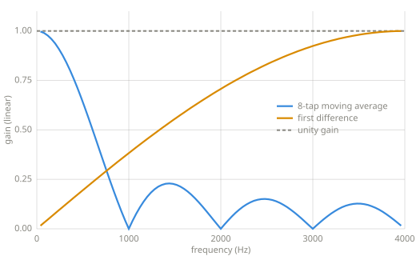
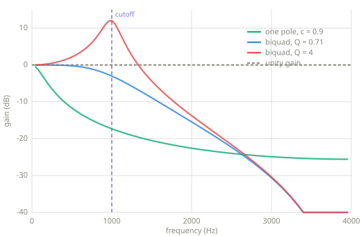

# Filters

> A filter is gain that depends on frequency: a volume knob for regions of the
> spectrum. Tone controls, equalizers, and synthesizer sweeps are all filters.

*Chapter 9 — filters.*

---

## Frequency response

[Chapter 8](frequency-domain.md) measured signals; a filter is measured the same way.
Play a probe tone through it, compare output amplitude to input amplitude, and repeat
across frequencies. The resulting gain-per-frequency curve is the filter's frequency
response, and every response figure on this page is measured exactly that way:

```python
--8<-- "code/filters.py:response"
```

A filter only changes how much of each frequency comes through. It cannot add a
frequency the input does not contain. Effects that add frequencies, like the distortion
of [Chapter 3](single-sample.md), are nonlinear.

## FIR: weighted sums of the input

The first family computes each output sample as a weighted sum of recent input samples,
read from the [Chapter 7](delay-modulation.md) ring buffer:

```python
--8<-- "code/filters.py:fir"
```

The weights are called taps, and the family is called FIR, for finite impulse
response. A single impulse in produces the tap list out, and the output ends after the
last tap. [Chapter 7](delay-modulation.md) drew impulse responses; an FIR filter's is
finite because the filter has no feedback to keep an input circulating.

Averaging smooths a signal, which dulls its edges, and
[Chapter 8](frequency-domain.md) showed that edges are high-frequency content. The
moving average is therefore a lowpass filter: it passes low frequencies and attenuates
high ones. The first difference responds to change and ignores steady level, which
makes it a highpass:



*Two FIR responses, measured by the probe method above. The moving average passes low
frequencies and nulls every tone whose cycles fit its window exactly. The first
difference blocks steady level and passes high frequencies.*

## IIR: feedback

The second family feeds output back in. The [Chapter 5](envelopes.md) smoother
belongs to this family and is its simplest member:

```python
--8<-- "code/filters.py:onepole"
```

The family is called IIR, for infinite impulse response. The feedback keeps a
fraction of every input circulating, so the response to an impulse decays without ever
exactly ending. The feedback comb of
[Chapter 7](delay-modulation.md) is the same idea with a long delay in the loop; the
one-pole filter is a comb whose delay is a single sample.

[Chapter 5](envelopes.md) deferred the name one-pole to this chapter. A filter's
behavior is summarized by its transfer function, a ratio of two polynomials, and the
roots of the denominator are called poles. Each feedback term contributes one pole, so
a filter with one feedback coefficient is a one-pole filter. A pole marks a frequency
region where feedback concentrates gain, and stronger feedback makes the response
sharper and more resonant. The Learn more references develop this in full.

## The biquad

Most practical audio filtering is built from the biquad, which combines two taps of
input history with two of feedback:

```python
--8<-- "code/filters.py:biquad"
```

The coefficient formulas come from Robert Bristow-Johnson's Audio EQ Cookbook, the
standard recipe collection for audio biquads. Two parameters drive them: the cutoff
frequency, and Q, which sets resonance. At $Q = 0.71$ the passband is maximally flat.
Higher Q lifts a peak at the cutoff, and that peak is the resonance heard in
synthesizer filter sweeps.



*Three IIR lowpass responses, measured. The one-pole rolls off gently. The biquad falls
faster past its cutoff, and raising Q from 0.71 to 4 lifts a resonant peak at the cutoff
itself.*

## Key parameters

| Parameter | What it controls |
|---|---|
| Cutoff | Where the passband ends (Hz). |
| Q | Resonance: how sharply the response peaks at the cutoff. |
| Taps / order | How many history terms the filter uses, and so how steep it can be. |

!!! warning "Pitfalls"
    - Feedback can diverge. The echo of [Chapter 7](delay-modulation.md) grew without
      bound past feedback 1, and IIR filters inherit the risk. Coefficients outside
      the stable range make the output grow without bound instead of filtering.
    - FIR filters delay the signal. A symmetric FIR with $N$ taps emits its response
      centered $(N-1)/2$ samples late, which is a fixed latency in a real-time path.
      Long FIR filters trade latency for steepness.
    - A linear filter cannot add frequencies. New frequencies in the output mean the
      process is nonlinear, deliberately or otherwise.

## Related effects

- [Envelopes](envelopes.md): the one-pole smoother, introduced there as the envelope
  follower's machinery.
- [Delay lines](delay-modulation.md): the comb and allpass are filters built from long
  delays, and the reverberator is a filter network.
- [Frequency-domain effects](frequency-effects.md): reshaping the spectrum directly,
  once [Chapter 10](transforms.md) provides the transform.

## Learn more

- Robert Bristow-Johnson, *Audio EQ Cookbook*,
  [w3.org/TR/audio-eq-cookbook](https://www.w3.org/TR/audio-eq-cookbook/) — the biquad
  recipes this page uses.
- Julius O. Smith III, *Introduction to Digital Filters*,
  [ccrma.stanford.edu/~jos/filters](https://ccrma.stanford.edu/~jos/filters/) — transfer
  functions and poles, in full.
- Steven W. Smith, *The Scientist and Engineer's Guide to Digital Signal Processing*,
  [dspguide.com](https://www.dspguide.com/) — FIR design, windowed sinc, and the
  trade-offs this chapter only names.
