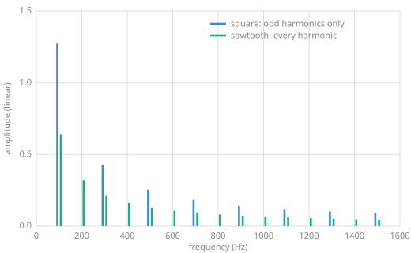
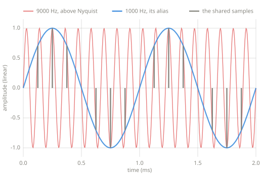

# The frequency domain

> Any repeating signal is a sum of sines. The frequency domain is the view that lists
> those sines: which frequencies a signal contains, and how much of each. Chapters 9
> through 11 work in this view.

*Chapter 8 — the frequency domain.*

---

## The claim

[Chapter 4](waveforms.md) promised that any signal can be described as a sum of sines.
The precise statement, due to Fourier, is that a signal repeating $f_0$ times per second
can be built from sines at $f_0$, $2 f_0$, $3 f_0$, and so on, each with its own
amplitude and phase. The multiples are called harmonics, and $f_0$ is the fundamental.
This book uses the theorem rather than proving it, and the Learn more section points
to proofs. The claim can also be checked numerically: if a square wave is a stack of
sines, a measurement of how much of one sine it contains should match the theory.

## Measuring one frequency

To ask how much of a probe frequency a signal contains, multiply the signal by a sine at
that frequency and average. Where the signal moves with the probe the products are
positive, where it moves against the probe they are negative, and any part of the signal
unrelated to the probe averages toward zero. A cosine probe joins the sine probe because
the signal's copy of the frequency can sit at any phase, and a phase the sine probe
misses is one the cosine probe catches:

```python
--8<-- "code/frequency.py:probe"
```

A spectrum is this question asked at many frequencies:

```python
--8<-- "code/frequency.py:spectrum"
```

## The waveforms, measured

The probe, run over the [Chapter 4](waveforms.md) waveforms, measures the harmonic
content behind their brightness ranking.



*Spectra of the square and sawtooth at 100 Hz, measured with the probe above. The
sawtooth carries every harmonic and the square only the odd ones; both fall off as one
over the harmonic number.*

The measured fundamentals are the Fourier coefficients themselves: $4/\pi$, about
1.27, for the square, and $2/\pi$, about 0.64, for the sawtooth. A component can be
larger than the signal that contains it. The square never leaves $\pm 1$, but its
fundamental alone swings to $\pm 1.27$, and the higher harmonics cancel the overshoot.

The shapes' edges determine which harmonics exist and how fast they fall off. A jump
contains every rate of change, so the square and sawtooth carry harmonics that fall
slowly, as $1/n$, and sound bright. The triangle has corners but no jumps, its harmonics
fall as $1/n^2$, and it sounds mellow. The sine's spectrum is a single stem at its own
frequency. The listening comparison in [Chapter 4](waveforms.md) matches the
measurement: jumps produce strong high harmonics, and corners produce weak ones.

## Nyquist and aliasing

A sample rate of $f_s$ samples per second can represent frequencies up to $f_s / 2$,
called the Nyquist frequency. This limit is the reason the book writes sample rates in
samples per second. A sine needs at least two samples
per cycle, one for each half, and $f_s$ samples per second cannot give two samples each
to more than $f_s / 2$ cycles.

Sampling maps every frequency above the Nyquist frequency onto one below it. The
error is called aliasing:



*A 9000 Hz tone sampled at 8000 samples per second, generated with the book's sine. At
every sample instant the 9000 Hz curve and the 1000 Hz curve agree, so the recorded
samples are indistinguishable from a 1000 Hz tone, and 1000 Hz is what plays back.*

The folded frequency is $|f - k \cdot f_s|$ for whichever integer $k$ lands the result
below Nyquist. This is the mechanism behind the [Chapter 3](single-sample.md) and
[Chapter 4](waveforms.md) warnings about naive waveforms: a sawtooth's harmonics
continue past any Nyquist frequency, and everything past the limit folds back down as
inharmonic content.

!!! warning "Pitfalls"
    - The probe assumes whole cycles. Measured over a window that cuts a cycle short, a
      probe reports some amplitude at frequencies the signal does not contain. The
      error is called spectral leakage, and [Chapter 10](transforms.md) returns to it.
    - The Nyquist frequency itself is not usable. Content at exactly
      $f_s / 2$ has two samples per cycle with no room for phase, and real systems
      filter before it.
    - A spectrum with no time axis describes a steady signal. Real audio changes, and
      describing change requires measuring spectra over short windows, which is the
      short-time analysis of [Chapter 10](transforms.md).

## Where this leads

[Chapter 9](filters.md) builds the effects that reshape a spectrum: gain per frequency.
[Chapter 10](transforms.md) computes every probe at once, which is the DFT.
[Chapter 11](frequency-effects.md) edits the measured spectrum directly and turns it
back into sound.

## Learn more

- Steven W. Smith, *The Scientist and Engineer's Guide to Digital Signal Processing*,
  [dspguide.com](https://www.dspguide.com/) (free online) — Fourier analysis at an
  introductory depth.
- Julius O. Smith III, *Mathematics of the DFT*,
  [ccrma.stanford.edu/~jos/mdft](https://ccrma.stanford.edu/~jos/mdft/) — the proofs
  this chapter defers.
- C. E. Shannon, "Communication in the Presence of Noise," Proceedings of the IRE,
  1949 — the sampling theorem.
