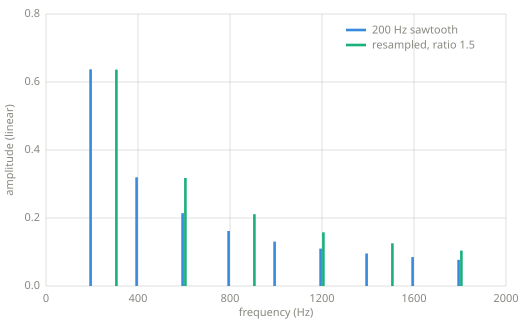

# Frequency-domain effects

> Analyze with the STFT, change the bins, resynthesize with the inverse. Every effect in
> this chapter is one edit inside that pattern.

*Chapter 11 — frequency-domain effects.*

---

## The pattern

[Chapter 10](transforms.md) ended with a round trip: `istft(stft(x))` returns the
signal it was given. That identity path is the basis for every effect here. The
forward transform turns audio into editable spectra, the edit does the effect's work,
and the inverse turns the result back into sound. The time-domain chapters worked with
gains and delay lines; this chapter rewrites bins.

## Resampling

The first effect predates the pattern and needs no transform. Reading a signal at a
different rate changes pitch and duration together, the way a tape machine does when
its speed changes:

```python
--8<-- "code/frequency_effects.py:resample"
```



*A 200 Hz sawtooth resampled at ratio 1.5, measured with the
[Chapter 8](frequency-domain.md) probe. Every harmonic moves to 1.5 times its
frequency. The
spectrum scales as a whole, so the result is the same sound higher, not a brighter
version of the original.*

Resampling cannot change pitch and duration separately; the two always move together.
Separating them, raising pitch while keeping length, requires the transform machinery,
and the phase vocoder cited under Learn more is the standard way to do it.

## Spectral filtering

The most direct bin edit deletes some bins. Zeroing everything above a cutoff is a
lowpass filter with a perfectly rectangular response, which no
[Chapter 9](filters.md) design achieves:

```python
--8<-- "code/frequency_effects.py:spectral"
```

The rectangular response has a cost. Each frame's edit spreads over the frame's whole
duration on resynthesis, so sharp spectral edges produce ringing around transients,
and heavy bin editing produces the watery artifact known as musical noise. Frequency-
domain filtering trades the smooth compromises of Chapter 9 for an exact response and
a new class of artifacts.

## Robotization

`robotize` in the listing above keeps every bin's amplitude and discards every phase.
Each frame then resynthesizes with all of its content aligned to the frame start, so
the output pulses at the frame rate no matter what pitch came in. Speech keeps its
vowels and consonants, since those live in the amplitude spectrum, but lands on one
constant buzz. [Chapter 10](transforms.md) listed phase as half the data; robotization
deletes that half deliberately.

## Key parameters

| Parameter | What it controls |
|---|---|
| Frame length | The resolution of every edit, inherited from the STFT. |
| Cutoff | For spectral filtering, the last surviving frequency. |
| Ratio | For resampling, the factor on pitch and on speed, jointly. |

!!! warning "Pitfalls"
    - Frequency-domain effects buy latency. An STFT effect cannot emit a frame before
      reading all of it, so the delay is at least one frame, and practical
      implementations add a frame of overlap. The real-time cost is structural, not an
      implementation detail.
    - Bin edits must respect the mirror. For real signals the upper half of the
      spectrum mirrors the lower half, and an edit applied to one half only produces a
      complex, unplayable result.
    - Musical noise. Aggressive independent bin edits decorrelate neighboring frames,
      and the residue is audible as watery chirping. Production spectral processors
      smooth their edits across time and frequency.

## Related effects

- [Filters](filters.md): the smooth time-domain route to the same goal as spectral
  filtering.
- [Delay lines](delay-modulation.md): the interpolated read that resampling reuses.
- [Waveforms](waveforms.md): the oscillators whose spectra these effects rewrite.

## Learn more

- Udo Zölzer (ed.), *DAFX: Digital Audio Effects*, 2nd ed., Wiley — the spectral
  processing chapters.
- Julius O. Smith III, *Spectral Audio Signal Processing*,
  [ccrma.stanford.edu/~jos/sasp](https://ccrma.stanford.edu/~jos/sasp/) — the STFT
  effect framework in full.
- J. Laroche and M. Dolson, "Improved Phase Vocoder Time-Scale Modification of Audio,"
  IEEE Transactions on Speech and Audio Processing, 1999 — pitch and time decoupled.
