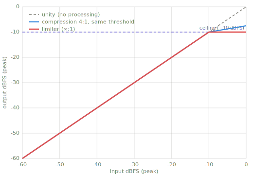
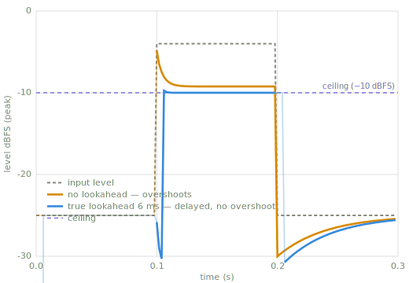

# Limiting

> A limiter holds its output at or below a fixed level, called the ceiling. Input below
> the ceiling passes through unchanged; input above it is reduced to the ceiling.

*Chapter 6 — companding. The fast, output-flattening end of
[Compression](compression.md); contrast with the slow, transparent [AGC](agc.md).*

---

## Intuition

A limiter is a compressor with an infinite ratio. A 4:1 compressor reduces 4 dB of
overshoot to 1 dB; as the ratio grows, the output above the threshold approaches a
constant. At an infinite ratio the overshoot is removed completely. The knee is hard and
the time constants are fast. The configuration is sometimes called brick-wall limiting.

Limiting has two uses. The first is protection. Digital audio clips at 0 dBFS, and
converters, transmitters, and storage formats each have a maximum level; a limiter placed
before such a stage keeps the signal below the maximum. The second is loudness. When the
peaks are held down, the overall level can be raised without clipping. This trades dynamic
range for loudness.

[AGC](agc.md) also holds its output approximately constant. The two are identical on a
steady-state transfer curve. They differ in release time: AGC releases over one second or
more and aims to be inaudible; a limiter releases in milliseconds and is audible on
transients.

## Key parameters

| Parameter | What it controls |
|---|---|
| Ceiling | The level (dBFS) the output must not exceed. |
| Release | How fast the gain recovers once the signal drops back below the ceiling (ms). |
| Attack / lookahead | How a peak is caught: a near-instant attack, or a short delay so the reduction is in place when the peak arrives. |
| Knee | Hard, almost always; the point of a limiter is a firm ceiling. |

## How it works

The pipeline is the same four stages as the other effects in this chapter.

1. Detect the peak level, per sample. Peak detection is used because the quantity being
   constrained is the instantaneous maximum, not the average.
2. Compare with the ceiling. At or below the ceiling, the gain is 0 dB. Above it, the gain
   reduction equals the overshoot, so the output equals the ceiling.
3. Smooth the gain with a fast attack and a chosen release.
4. Apply the gain to the signal.



*The limiter's transfer curve beside a 4:1 compressor at the same threshold. The
compressor reduces the slope; the limiter holds the output flat. The red ∞:1 curve on the
Compression page's figure is this same curve.*



*Both traces come from running this book's configurable compressor
(`code/make_figures.py`) at ∞:1. Without lookahead, the leading edge of the burst passes
the ceiling while the 2 ms attack catches up. With true lookahead the gain is pre-armed
and the output never crosses the ceiling; it also arrives 6 ms late, the cost of the
guarantee.*

## Pseudocode

```text
for each sample x:
    level   = dBFS(|x|)                       # peak detector
    over    = level - ceiling
    target  = -over  if over > 0 else 0       # infinite ratio: clamp to the ceiling
    gain    = smooth(gain, target, attack, release)   # very fast attack
    y = x * dB_to_linear(gain)
```

## Reference implementation (Python)

```python
import math

def limit(x, sr, ceiling_db=-1.0, attack_ms=1.0, release_ms=50.0):
    """Feed-forward peak limiter — pure standard library, no dependencies.

    Holds the output at or below ceiling_db. It is a compressor with an
    infinite ratio (any overshoot is removed) and a very fast attack.

    x:  list of mono samples in [-1, 1]
    sr: sample rate (Hz)
    Returns a new list of samples.
    """
    atk = math.exp(-1.0 / (sr * attack_ms  / 1000.0))
    rel = math.exp(-1.0 / (sr * release_ms / 1000.0))
    eps = 1e-9

    y = []
    env_db = 0.0     # smoothed gain reduction, in dB (<= 0)
    for sample in x:
        level_db = 20.0 * math.log10(abs(sample) + eps)
        over = level_db - ceiling_db
        target = -over if over > 0.0 else 0.0     # infinite ratio
        coeff = atk if target < env_db else rel   # attack when clamping harder
        env_db = coeff * env_db + (1.0 - coeff) * target
        y.append(sample * 10.0 ** (env_db / 20.0))
    return y
```

!!! warning "Pitfalls"
    - Overshoot without lookahead. A feed-forward limiter reacts after a peak begins, so
      the leading edge passes above the ceiling during the attack time. Lookahead limiters
      delay the audio and compute the gain from the undelayed signal; the cost is latency
      equal to the lookahead time.
    - Inter-sample (true) peaks. Holding every sample at the ceiling does not hold the
      reconstructed waveform there; the continuous signal between samples can exceed the
      samples. Production limiters oversample and enforce a true-peak (dBTP) ceiling;
      ITU-R BS.1770 defines the measurement.
    - Release artifacts. A release comparable to the period of low-frequency content
      tracks individual cycles and distorts them; a long release lowers the level audibly
      after each peak (pumping). The ceiling is a specification; the release is chosen by
      listening.
    - Overuse. Heavy limiting removes the dynamics from the material.

## Related effects

- [Compression](compression.md): the finite-ratio version; a limiter is the ∞:1 extreme.
- [Automatic Gain Control](agc.md): also holds the output flat, but slowly and
  transparently.
- Clipping: the crude alternative; the peaks are cut off where they stand, which adds
  harsh distortion.

## Learn more

- Udo Zölzer (ed.), *DAFX: Digital Audio Effects*, 2nd ed., Wiley.
- ITU-R BS.1770 — true-peak (dBTP) measurement, the reason production limiters oversample.
- Reference implementations: [audacity](references.md#audacity), a true look-ahead limiter,
  and [sox](references.md#sox), limiting via a steep transfer curve. Context in the
  [References](references.md) appendix.
