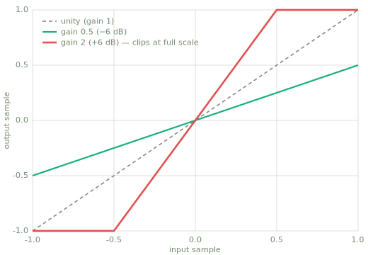
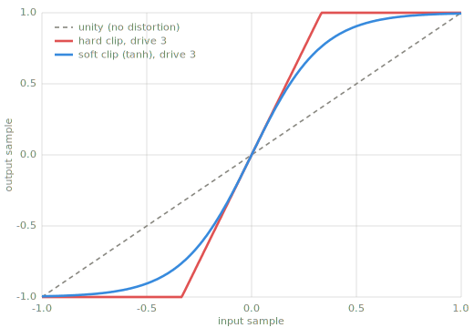
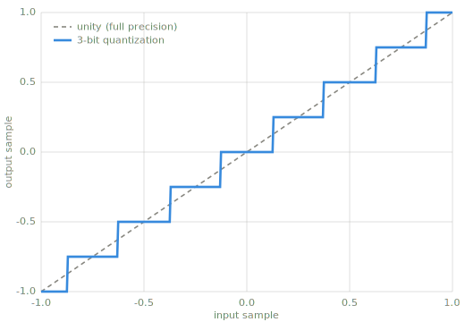

# Single-sample effects

> A single-sample effect keeps no state: each output sample is a function of the current
> input sample alone, `y[n] = f(x[n])`. The whole effect is one curve, applied one sample
> at a time.

*Chapter 3 — stateless effects: volume, distortion, and bit crush.*

---

## One curve is the whole effect

Because `f` sees a single sample and remembers nothing, an effect in this class can be
drawn completely: plot input sample against output sample, both in [-1, 1], and the curve
is the effect. The diagonal is unity — the effect that does nothing. Everything in this
chapter is a choice of curve.

The three effects below form a chain. Volume is the simplest possible curve, and turning
it up raises the first hard question: what happens at full scale. Distortion is that
answer made deliberate, and bit crush trades precision away on purpose.

These are linear-amplitude plots, not dB: a single sample has no level (see
[Measuring sound](conventions.md)), so this chapter works directly on sample values.

## Volume

The volume effect multiplies every sample by a constant. Its curve is a straight line
through the origin; the gain is the slope.

```python
def volume(x, gain_db):
    """Scale every sample by a gain given in dB."""
    g = 10.0 ** (gain_db / 20.0)
    return [s * g for s in x]
```

Gain is stated in dB and applied linearly, per [Measuring sound](conventions.md). A gain
below 1 makes the line shallower; a gain above 1 makes it steeper — and a steep enough
line runs into the edge of the range.



*Two volume settings (`code/make_figures.py`). The gain-2 line reaches ±1.0 at input
±0.5; whatever plays this signal flattens everything beyond that point. There is no volume
knob without a clipping question.*

!!! warning "Pitfall"
    A gain above 1 does not clip by itself — multiplication happily produces 1.7 — but the
    converter, file format, or next effect will. Decide where the clipping happens instead
    of letting it happen somewhere surprising.

## Distortion

Distortion is clipping done on purpose. The input is driven into a curve that flattens
toward the limits, and the flattening reshapes the waveform. Two standard curves:

- Hard clipping cuts everything past a limit to the limit: a plateau with sharp corners.
- Soft clipping bends toward the limits gradually; `tanh` is the usual choice. The corners
  are rounded, and the sound is smoother.

```python
import math

def hard_clip(x, drive=3.0):
    """Amplify by drive, then cut everything past full scale."""
    return [max(-1.0, min(1.0, drive * s)) for s in x]

def soft_clip(x, drive=3.0):
    """Amplify by drive inside tanh, which saturates smoothly toward ±1."""
    return [math.tanh(drive * s) for s in x]
```



*Hard and soft clipping at the same drive (`code/make_figures.py`). The drive parameter
sets how far the signal is pushed into the curve; the curve's shape sets the character of
the result.*

The [Visualizations](visualizations.md) appendix has two interactive demos of exactly this:
a waveform explorer with an adjustable soft-clip depth, and a Web Audio tone generator
whose clipping stage can be heard as well as seen.

!!! warning "Pitfalls"
    - Clipping raises loudness without raising the peak: a clipped signal has a lower
      crest factor, so it reads louder at the same 0 dBFS ceiling. This is a use and a
      trap.
    - A nonlinear curve manufactures new frequencies that were not in the input, and some
      of them land above what the sample rate can represent. The result is aliasing.
      Chapters [7](frequency-domain.md) and [9](transforms.md) explain the mechanism; until
      then, know that digital distortion at high drive can add a harsh, non-harmonic edge
      that analog circuits do not.

## Bit crush

Bit crush reduces the precision of every sample: each value is rounded to the nearest of a
small set of levels, as if the audio were stored in fewer bits. The transfer curve is a
staircase.

```python
def bit_crush(x, bits=3):
    """Round every sample to a grid of 2**(bits-1) steps per side."""
    levels = 2 ** (bits - 1)
    return [round(s * levels) / levels for s in x]
```



*Three-bit quantization (`code/make_figures.py`). The vertical gap between the staircase
and the unity line is the quantization error for that input value.*

The error is largest, relative to the signal, when the signal is small: a quiet passage
may spend its whole life inside two or three steps, and the rounding becomes a coarse,
gritty texture. Loud material barely notices. As an effect this is the point — bit crush
is used for that texture — but the same arithmetic happens uninvited whenever audio is
stored with too few bits.

!!! warning "Pitfall"
    Quantization error is not hiss. It correlates with the signal, so it reads as grit and
    fizz attached to the sound rather than a steady noise floor underneath it.

## Where this leads

The transfer curve returns in [Chapter 6](compression.md), drawn in dB, and the
resemblance is worth a careful look: a compressor's curve is applied to a measured level
with memory (attack, release), while this chapter's curves are applied to raw samples with
none. Same picture, different domain. The waveforms these effects chew on come next, in [Chapter 4](waveforms.md).

## Learn more

- Udo Zölzer (ed.), *DAFX: Digital Audio Effects*, 2nd ed., Wiley — nonlinear processing
  is the same chapter that covers dynamics; see [References](references.md#dafx).
