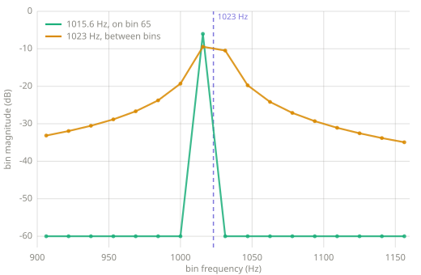
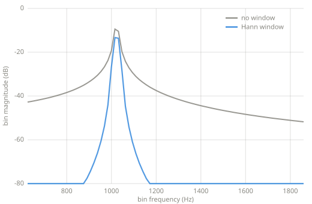
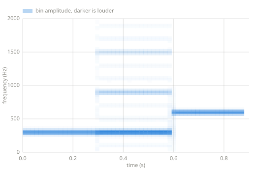

# DFT, FFT, STFT

> The discrete Fourier transform runs every Chapter 8 probe at once: one block of
> samples in, one complete spectrum out. The FFT computes the same numbers quickly, and
> the STFT repeats the measurement over time.

*Chapter 10 — the transforms.*

---

## The DFT

[Chapter 8](frequency-domain.md) measured one frequency with a pair of probes.
The discrete Fourier transform measures all of them. For a block of $N$ samples, it
correlates the block with the frequencies $k \cdot f_s / N$ for every $k$, and each bin
stores the two probe results as one complex number, so amplitude and phase travel
together:

```python
--8<-- "code/transforms.py:dft"
```

The bin spacing is $f_s / N$. A larger block resolves finer frequency differences and
covers a longer stretch of time, so one number controls both, and no block length gives
fine frequency detail and fine time detail at once.

## The FFT

The DFT above computes $N$ sums of $N$ terms. The fast Fourier transform produces the
same bins in about $N \log N$ steps by splitting the block into its even and odd
samples, transforming each half, and combining:

```python
--8<-- "code/transforms.py:fft"
```

The bins are identical to the DFT's; only the cost changes. The FFT is the reason
transforming audio is cheap enough to run inside effects, and the reason block lengths
are usually powers of two.

## Windows

[Chapter 8](frequency-domain.md) noted that a probe over partial cycles reports
amplitude at frequencies the signal does not contain, and named the error spectral
leakage. Which frequencies leak depends on the block length. Bins sit $sr/N$ apart,
which is 15.625 Hz for the 8000 Hz, 512-sample block used below. A tone at exactly a bin
frequency completes a whole number of cycles in the block and reports as that one bin.
Almost no real tone sits at a bin frequency.



*Two sines through the same transform, neither windowed. At 1015.6 Hz the tone is bin 65
exactly. It reads $-6$ dB, its true amplitude, and every other bin is empty. At 1023 Hz,
7 Hz higher and equally steady, no bin reads it correctly. The two nearest bins split it
at $-9.5$ and $-10.5$ dB, and the rest of the block carries the remainder. Dots mark the
bins. A magnitude exists only at a dot, and the line between the dots carries no data.*

The spread in the second trace is leakage. Both tones went through the same unwindowed
transform, so the bin grid accounts for the difference between them. The standard
treatment multiplies the block by a window, a curve that fades the frame in and out so
its edges no longer jump:

```python
--8<-- "code/transforms.py:window"
```



*The 1023 Hz tone again, with the window as the only difference between the traces. Both
share the same two-bin top, tilted because 1023 Hz sits nearer bin 65 than bin 66. That
tilt comes from the bin grid, which is why it appears in both traces. The window acts on
the skirt. Unwindowed, the tone still reports above $-52$ dB at every bin in the range.
Windowed, it falls through the $-80$ dB floor of the plot within about ten bins. That
flat blue run is the floor of the plot. The windowed skirt keeps falling, and reaches
$-100$ dB by 700 Hz.*

## The STFT

A single spectrum describes a steady signal. The short-time Fourier transform describes
a changing one: slice the signal into overlapping frames, window each frame, and
transform each window. The result is a spectrum per frame, and drawing them side by side
is a spectrogram:

```python
--8<-- "code/transforms.py:stft"
```



*The STFT of a 300 Hz sine, then a 300 Hz square, then a 600 Hz sine, generated with the
code above. The sine is one line, and the higher sine is one line again, higher. The
square shows two interleaved stacks. Its odd harmonics fall at 300, 900, and 1500 Hz,
and a fainter set falls at 100, 500, 700, 1100, 1300, and 1700 Hz.*

The fainter stack is aliasing. The square here is the naive one from
[Chapter 4](waveforms.md), so its odd harmonics continue past the 4000 Hz Nyquist
frequency without limit, and each one folds to $|f - k \cdot f_s|$ as
[Chapter 8](frequency-domain.md) describes. The 25th harmonic at 7500 Hz returns as
500 Hz, the 27th at 8100 Hz returns as 100 Hz, and the 23rd at 6900 Hz returns as
1100 Hz. The folded frequencies are all multiples of 100 Hz because
$\gcd(300, 8000) = 100$, and all odd multiples because folding preserves oddness, so
they occupy the gaps between the true harmonics and show as separate lines. A
bandlimited oscillator would leave only the three true lines.

The inverse path matters as much as the forward one. `istft` adds the overlapping frames
back together, and with the Hann window at half-frame overlap the shifted windows sum to
one, so a signal survives the round trip unchanged. [Chapter 11](frequency-effects.md)
edits the bins between the two directions.

## Key parameters

| Parameter | What it controls |
|---|---|
| Frame length | Frequency resolution against time resolution: $f_s / N$ bin spacing over $N / f_s$ seconds of blur. |
| Hop | How far the frame advances per spectrum; half the frame length here. |
| Window | How the frame's edges fade; Hann on this page. |

!!! warning "Pitfalls"
    - This page's FFT requires power-of-two lengths. General lengths have fast
      algorithms, and practical libraries provide them; the constraint belongs to the
      radix-2 split, not to the transform.
    - Bins are evenly spaced in frequency, and musical pitch is not. The octave from
      100 to 200 Hz spans six bins at this page's settings, and the octave from 3200 to
      6400 Hz spans two hundred, so low notes blur together in a spectrogram long
      before high ones.
    - Phase is half the data. Amplitude spectra read well, and resynthesis without the
      phases produces a different signal, which [Chapter 11](frequency-effects.md)
      turns into an effect on purpose.

## Where this leads

[Chapter 11](frequency-effects.md) runs effects inside the transform: analyze, change
the bins, resynthesize.

## Learn more

- Julius O. Smith III, *Mathematics of the DFT*,
  [ccrma.stanford.edu/~jos/mdft](https://ccrma.stanford.edu/~jos/mdft/) — the transform
  with proofs.
- Steven W. Smith, *The Scientist and Engineer's Guide to Digital Signal Processing*,
  [dspguide.com](https://www.dspguide.com/) — the FFT chapter walks the split in
  detail.
- J. W. Cooley and J. W. Tukey, "An Algorithm for the Machine Calculation of Complex
  Fourier Series," Mathematics of Computation, 1965 — the FFT paper.
