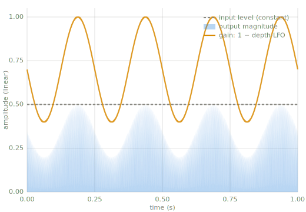

# Tremolo

> Tremolo varies a signal's volume periodically: an LFO drives the gain up and down at a
> rate set by a clock, not by the signal.

*Chapter 5 — envelopes & tremolo. A generated control curve pointed at volume; the
companding effects of [Chapter 6](compression.md) replace its clock with a level
detector.*

---

!!! note "Tremolo is not vibrato"
    Tremolo modulates volume; vibrato modulates pitch ([Chapter 7](delay-modulation.md)).
    Decades of guitar amplifiers label a tremolo circuit "vibrato," so the two words are
    unreliable in the wild. This page is the volume effect.

## Intuition

Tremolo is a volume knob turned by an oscillator. The [LFO of Chapter 4](waveforms.md)
sweeps between 0 and 1 a few times per second, the gain follows it, and the sound swells
and dips at that rate. Nothing about the effect listens to the signal: the same wobble is
applied whether the input is loud, quiet, or silent. That indifference is what separates
tremolo from the companding effects of [Chapter 6](compression.md) — Compression,
Limiting, Expanding, and AGC all move the same volume knob, but they move it in response
to a measured level.

## Key parameters

| Parameter | What it controls |
|---|---|
| Rate | The LFO frequency (Hz). A few hertz is the classic pulse; above roughly 20 Hz the wobble stops reading as movement and starts changing the tone. |
| Depth | How far the gain drops at the LFO's trough, from 0 (no effect) to 1 (full silence). |
| LFO shape | Sine gives a smooth swell; a square chops between two levels. |

## How it works

1. Run an LFO: an oscillator at the rate, mapped into $[0, 1]$.
2. Convert it to a gain between $1 - d$ and 1, for a depth $d$:
   $g[n] = 1 - d \cdot m[n]$, where $m[n]$ is the LFO value.
3. Multiply the signal by the gain, sample by sample.



*Tremolo at 4 Hz, depth 0.6 (`code/make_figures.py`). The input level is constant; the
gain swings between 1 and 1 − depth; the output magnitude carries the wobble.*

The same thing, audible — a steady tone, then the identical tone through tremolo at 5 Hz,
depth 0.8 (`code/make_demos.py`):

| signal | listen |
|---|---|
| plain tone | <audio controls src="../audio/sine_220hz.wav" aria-label="plain sine tone, 220 hertz"></audio> |
| with tremolo | <audio controls src="../audio/tremolo_220hz.wav" aria-label="the same tone with tremolo at 5 hertz"></audio> |

## Reference implementation (Python)

Included at build time from `code/oscillators.py`:

```python
--8<-- "code/oscillators.py:tremolo"
```

!!! warning "Pitfalls"
    - Depth 1.0 silences the troughs completely; the effect stops swelling and starts
      chopping.
    - A square LFO changes the gain instantaneously, and instantaneous gain changes click
      (the same fact that motivates attack and release in
      [Chapter 5](envelopes.md)). Hardware tremolos smooth the square's edges.
    - Push the rate past roughly 20 Hz and the modulation itself becomes audible as new
      frequencies around the tone, not as movement. That boundary is the LFO definition
      from [Chapter 4](waveforms.md), met from the other side.

## Related effects

- [Compression](compression.md), [Limiting](limiter.md), [Expanding](expander.md), and
  [AGC](agc.md): the same volume knob, driven by a level detector instead of a clock.
- Vibrato ([Chapter 7](delay-modulation.md)): the same LFO pointed at pitch instead of
  volume.

## Learn more

- Udo Zölzer (ed.), *DAFX: Digital Audio Effects*, 2nd ed., Wiley — modulation effects.
