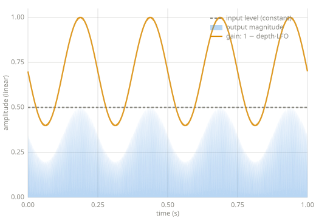

# Tremolo

> Tremolo varies a signal's volume periodically: an LFO drives the gain up and down at a
> rate set by a clock, not by the signal.

*Chapter 5 — tremolo & envelopes. A generated control curve pointed at volume; the
companding effects of [Chapter 6](compression.md) replace its clock with a level
detector.*

---

!!! note "Tremolo is not vibrato"
    Tremolo modulates volume; vibrato modulates pitch ([Chapter 7](vibrato.md)).
    Decades of guitar amplifiers label a tremolo circuit "vibrato," so the label on an
    amplifier is unreliable. This page is the volume effect.

## Intuition

Tremolo is a volume knob turned by an oscillator. The [LFO of Chapter 4](waveforms.md)
sweeps between 0 and 1 a few times per second, the gain follows it, and the sound swells
and dips at that rate. Nothing about the effect listens to the signal. The same wobble
applies whether the input is loud, quiet, or silent, and that indifference separates
tremolo from the companding effects of [Chapter 6](compression.md). Compression,
Limiting, Expanding, and AGC move the same volume knob, but they move it in response to
a measured level.

## Key parameters

| Parameter | What it controls |
|---|---|
| Rate | The LFO frequency (Hz). A few hertz is the classic pulse; above roughly 20 Hz the wobble stops reading as movement and starts changing the tone. |
| Depth | How far the gain drops at the LFO's trough, from 0 (no effect) to 1 (full silence). |
| LFO shape | Sine gives a smooth swell; a square chops between two levels. |

## How it works

1. Run an LFO: an oscillator at the rate, mapped into $[0, 1]$.
2. Convert it to a gain between $1 - d$ and 1, for a depth $d$:
   $g[n] = 1 - d \cdot m[n]$, where $m[n]$ is the LFO value.
3. Multiply the signal by the gain, sample by sample.



*Tremolo at 4 Hz, depth 0.6. The input level is constant; the
gain swings between 1 and 1 − depth; the output magnitude carries the wobble.*

The effect is audible below. Depth 0 leaves the tone steady, which is the reference
to listen against, and raising the depth opens the swing between 1 and 1 − depth. The
display shows the last second of output under the LFO-driven gain.

<iframe src="../visualization/tremolo_explorer.html" title="Tremolo AudioExplorer" loading="lazy" style="width:100%; height:440px; border:1px solid #d8d8d2; border-radius:8px;"></iframe>

## Reference implementation (Python)

Included at build time from `code/oscillators.py`:

```python
--8<-- "code/oscillators.py:tremolo"
```

!!! warning "Pitfalls"
    - Depth 1.0 silences the troughs completely. The effect stops swelling and starts
      chopping.
    - A square LFO changes the gain instantaneously, and instantaneous gain changes click
      (the same fact that motivates attack and release in
      [Envelopes](envelopes.md), this chapter's next page). Hardware tremolos smooth the
      square's edges.
    - Push the rate past roughly 20 Hz and the modulation itself becomes audible as new
      frequencies around the tone, not as movement. That boundary is the 20 Hz LFO
      definition from [Chapter 4](waveforms.md), approached from above.

## Related effects

- [Compression](compression.md), [Limiting](limiter.md), [Expanding](expander.md), and
  [AGC](agc.md): the same volume knob, driven by a level detector instead of a clock.
- Vibrato ([Chapter 7](vibrato.md)): the same LFO pointed at pitch instead of
  volume.

## Learn more

- Udo Zölzer (ed.), *DAFX: Digital Audio Effects*, 2nd ed., Wiley — modulation effects.
