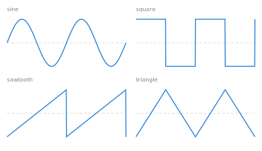
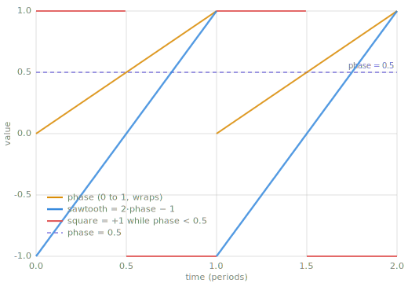

# Waveforms & oscillators

> The effect chapters consume waveforms and the oscillators that generate them. This
> chapter defines both.

*Chapter 4 — the signals the rest of the book runs on. The code on this page is included
at build time from `code/oscillators.py`, which is tested, drawn from by the figures, and
rendered by the audio demos.*

---

## Sine waves

A sine wave is the simplest periodic signal. Its amplitude sets how far it swings, its
frequency sets how many cycles fit into one second, and its phase sets where in the cycle
it starts:

$$
x[n] = A \sin\!\left(2\pi f \frac{n}{f_s} + \phi\right)
$$

where $A$ is the amplitude, $f$ the frequency, $n$ the sample index, $f_s$ the sample
rate in samples per second (`sr` in the code), and $\phi$ the phase.

```python
--8<-- "code/oscillators.py:sine"
```

The book has been using this generator since [Measuring sound](conventions.md). The sine
matters more later, when [Chapter 8](frequency-domain.md) describes any signal as a sum
of sines. Here it is the first waveform and the plainest-sounding one. A sine has no
edges and contains nothing but its one frequency.

## The standard waveforms

Three more shapes recur throughout audio work. The square flips between +1 and −1. The
sawtooth climbs steadily and drops instantly. The triangle rises and falls in straight
lines.



*The four standard waveforms (`code/make_figures.py`). The square and sawtooth contain
jumps, and the triangle contains corners; only the sine is smooth everywhere.*

The same four, audible — 220 Hz for 1.5 s, generated by `code/make_demos.py` from the
oscillators on this page:

| waveform | listen |
|---|---|
| sine | <audio controls src="../audio/sine_220hz.wav" aria-label="sine wave, 220 hertz"></audio> |
| square | <audio controls src="../audio/square_220hz.wav" aria-label="square wave, 220 hertz"></audio> |
| sawtooth | <audio controls src="../audio/sawtooth_220hz.wav" aria-label="sawtooth wave, 220 hertz"></audio> |
| triangle | <audio controls src="../audio/triangle_220hz.wav" aria-label="triangle wave, 220 hertz"></audio> |
| all four in sequence | <audio controls src="../audio/all_waveforms_220hz.wav" aria-label="all four waveforms in sequence, 220 hertz"></audio> |

All four tones have the same peak amplitude, and they sound neither equally bright nor
equally loud. Ranked by brightness they run sine, triangle, square,
sawtooth. The sine is a pure tone, the triangle adds faint upper harmonics, and the
square and sawtooth are rich and buzzy. The ranking follows the edges. Corners add weak
harmonics, and jumps add strong ones. Jumps and corners are what harmonics look like in
the time domain, and [Chapter 8](frequency-domain.md) makes that correspondence exact.

The square and sawtooth also sound louder. At the same peak, a squarer shape carries
more energy (a higher RMS, so a lower crest factor), and much of that energy sits at
high frequencies, where hearing is sensitive. All five clips read the same on a peak
meter. The peak level matches while the loudness differs, which is the distinction
[Measuring sound](conventions.md) draws.

The sawtooth drawn here rises and drops; its mirror image falls and jumps. As tones the
two are indistinguishable. The harmonic magnitudes are identical, and the ear is largely
deaf to the phase difference between them. Direction starts to matter when the waveform
is a control signal. A rising ramp swells gradually and cuts off. A falling ramp starts
hard and fades. At LFO rates ([below](#low-frequency-oscillators)) the difference is
plainly audible in whatever the ramp drives.

The versions here are the naive versions, and the caveat from
[Chapter 3](single-sample.md) applies to them too: shapes with jumps and corners contain
frequencies without limit, and everything above what the sample rate can represent folds
back down as aliasing. At 220 Hz the aliasing is mild. A naive sawtooth a few octaves
up makes the fold-back plainly audible. Bandlimited oscillator designs exist for exactly
this reason, and this book lists one under Learn more.

## The oscillator pattern

All four waveforms come from one pattern: a phase value that climbs from 0 to 1 and
wraps, advancing by $f / f_s$ each sample, and a shape function that maps phase to a
sample.

```python
--8<-- "code/oscillators.py:oscillator"
```

```python
--8<-- "code/oscillators.py:shapes"
```

`sine_wave` at the top of this page is `oscillator(sine_shape, ...)` with the phase
multiplied out. The other shapes are where the pattern becomes useful.



*The phase accumulator (`code/make_figures.py`). The sawtooth is the phase ramp made
audible, since the shape function only rescales it to ±1. The square is a single
comparison, +1 while the phase is below one half, and the dashed line marks that
comparison's threshold. Wraps and flips are drawn as gaps rather than vertical lines.*

!!! warning "Pitfall"
    The phase step is a float, and rounding error accumulates: after many cycles, the
    exact sample on which the wrap lands can shift by one. Code that expects sample-exact
    periodicity from a float phase accumulator (a test comparing waveforms across a
    period boundary, for example) will fail at the discontinuities. This book's own test
    suite hit this. The periodicity test now uses the sine, which is smooth across the
    wrap.

## Low-frequency oscillators

An oscillator run below roughly 20 Hz is no longer heard as a tone. It is felt as
change. Used that way it is called a low-frequency oscillator, or LFO, and its output
becomes a control signal rather than a sound, something for another effect's parameter
to follow. [Tremolo](tremolo.md) is the first consumer, an LFO driving a volume knob,
and the swept delays of [Chapter 7](vibrato.md) are driven the same way.

## Where this leads

[Chapter 5](envelopes.md) takes up envelopes, and its [tremolo](tremolo.md) puts this
chapter's LFO on a volume knob. [Chapter 7](delay-modulation.md) points LFOs at delay
times instead of volume. [Chapter 8](frequency-domain.md) returns to the sine and makes
the sum-of-sines claim precise.

## Learn more

- Udo Zölzer (ed.), *DAFX: Digital Audio Effects*, 2nd ed., Wiley.
- Julius O. Smith III, *Introduction to Digital Filters*,
  [ccrma.stanford.edu/~jos/filters](https://ccrma.stanford.edu/~jos/filters/) — the
  one-pole smoother, formally.
- V. Välimäki and A. Huovilainen, "Antialiasing Oscillators in Subtractive Synthesis,"
  IEEE Signal Processing Magazine, 2007 — bandlimited oscillator designs.
